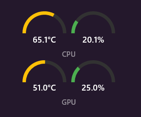

<div align="center">

# CPU/GPU Dashboard

### A Rainmeter Skin for Real-Time Hardware Monitoring



A clean, modern Rainmeter skin that displays real-time CPU and GPU temperature and usage metrics from HWiNFO64.

---

</div>

## ✨ Features

| | |
|:--|:--|
| 🌡️ Real-time CPU temperature and usage | 🎮 Real-time GPU temperature and usage |
| 🎨 Temperature-based dynamic background color (green → yellow → red) | 🔧 First-run setup wizard for sensor configuration |
| ✅ Automatic validation with error handling | 💾 Persistent settings |

---

## 📋 Requirements

| Software | Version | Link |
|:---------|:--------|:-----|
| **Rainmeter** | 4.5+ | [Download](https://www.rainmeter.net/) |
| **HWiNFO64** | 7.02+ | [Download](https://www.hwinfo.com/) |

---

## 🚀 Installation

1. Copy the `CPUGPUDashboard` folder to your Rainmeter Skins directory:
   ```
   Documents\Rainmeter\Skins\
   ```

2. Right-click the Rainmeter tray icon → **Refresh All**

3. Navigate to `CPUGPUDashboard` → `Dashboard` → Load `Dashboard.ini`

---

## ⚙️ HWiNFO64 Setup

<details>
<summary><b>Step 1:</b> Run HWiNFO64</summary>

Launch HWiNFO64 in **Sensors-only** mode.

</details>

<details>
<summary><b>Step 2:</b> Enable Gadget Reporting</summary>

1. In the Sensors window, click the **gear icon** (Configure Sensors)
2. Go to the **HWiNFO Gadget** tab
3. Check **"Enable reporting to Gadget"**

</details>

<details>
<summary><b>Step 3:</b> Select Sensors to Export</summary>

1. Find your CPU temperature sensor (e.g., "CPU (Tctl/Tdie)" for AMD, "CPU Package" for Intel)
2. Check **"Report value in Gadget"**
3. Note the **Index** number assigned
4. Repeat for:
   - CPU Usage (Total)
   - GPU Temperature
   - GPU Usage

</details>

<details>
<summary><b>Step 4:</b> Find Your Index Numbers</summary>

Open Command Prompt and run:
```cmd
reg query HKEY_CURRENT_USER\SOFTWARE\HWiNFO64\VSB
```

Look for entries like:
- `Label0` = "CPU (Tctl/Tdie)" → Index is **0**
- `Label1` = "Total CPU Usage" → Index is **1**
- etc.

</details>

---

## 🎛️ Configuration

On first run, the Setup skin will appear. Enter your HWiNFO sensor indexes:

| Field | Description | Example |
|:------|:------------|:-------:|
| CPU Temperature Index | Index for CPU temp sensor | `0` |
| CPU Usage Index | Index for CPU usage sensor | `1` |
| GPU Temperature Index | Index for GPU temp sensor | `2` |
| GPU Usage Index | Index for GPU usage sensor | `3` |

Click **Save & Launch Dashboard** when done.

---

## 🔄 Reconfiguring

To change sensor indexes:
1. Click the **Setup** button on the dashboard
2. Enter new values
3. Save and relaunch

---

## 🔧 Troubleshooting

<details>
<summary><b>"Sensor Error" message</b></summary>

- Ensure HWiNFO64 is running with Gadget reporting enabled
- Verify your sensor indexes are correct
- Check if HWiNFO is using HKEY_CURRENT_USER or HKEY_LOCAL_MACHINE

</details>

<details>
<summary><b>Values show as 0 or blank</b></summary>

- Confirm the sensors are enabled for Gadget reporting in HWiNFO
- Make sure the index numbers match the registry entries

</details>

<details>
<summary><b>InputText fields don't appear</b></summary>

- Ensure the skin's AlwaysOnTop setting is not set to 2
- Try refreshing the skin

</details>

---

## 🎨 Customization

Edit `@Resources\Variables.inc` to customize:

```ini
; Temperature thresholds (Celsius)
TempLow=40
TempMedium=60
TempHigh=80

; Colors (R,G,B,A)
ColorBackground=33,33,33,255
ColorText=255,255,255,255

; Dimensions
SkinWidth=280
SkinHeight=150
```

---

## 📁 File Structure

```
CPUGPUDashboard/
├── 📂 @Resources/
│   ├── Variables.inc    # User settings
│   └── Styles.inc       # Meter styles
├── 📂 Dashboard/
│   └── Dashboard.ini    # Main display
├── 📂 Setup/
│   └── Setup.ini        # Configuration wizard
└── README.md
```

---

## 📝 Technical Notes

- Uses HWiNFO's Gadget feature (Registry-based, not Shared Memory)
- Registry path: `HKEY_CURRENT_USER\SOFTWARE\HWiNFO64\VSB`
- Updates every 1 second (1000ms)

---

## 📄 License

MIT License - Feel free to modify and share.
